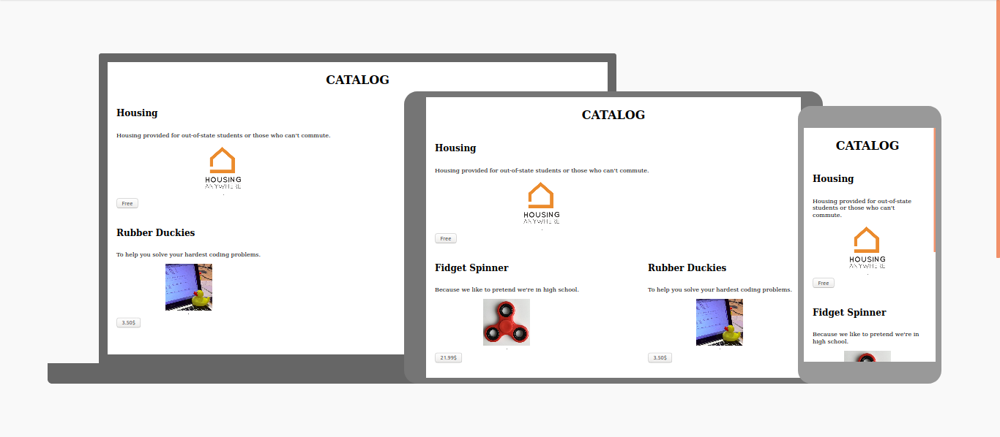

# Full React Course 2020 - Basics

Watch the full course [on the freeCodeCamp.org YouTube channel](https://www.youtube.com/watch?v=4UZrsTqkcW4) (10-hour watch).

## Topics

- Folder Structure
- Clean Boilerplate
- Hello World
- [JSX Rules](src/components/Examples.js#L4)
- [Nested Components And Tools](src/components/App.js#L5)
- [CSS Basics](src/index.js#L6)
- [JSX Css](src/components/Catalog.js#L9)
- Props
- [Props Destructuring](src/components/Item.js#L3)
- Props Children
- [Key Prop](src/components/Catalog.js#L10)
- Simple List
- Proper List
- Spread Operator
- Event Basics
- Import And Export Statements

## Mini Projects

### Hello, World!

### Catalogß

